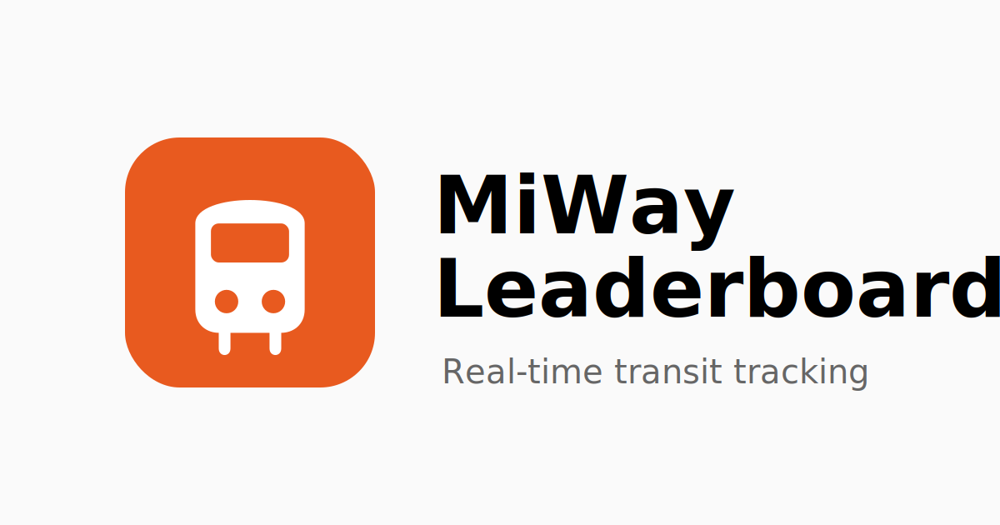

# MiWay Live Leaderboard



This website shows live average route speeds for MiWay vehicles in Mississauga using GTFS-RT data.

## 🛠️ Tech Stack

| Layer | Technology |
|-------|------------|
| Frontend | React 19 + TypeScript |
| Animations | Framer Motion |
| Build Tool | Vite |
| Backend | Vercel Serverless Functions |
| Data Source | MiWay GTFS-RT Feed |
| Analytics | Vercel Analytics |

## 🚀 Getting Started

### Prerequisites
- Node.js 20.x or later
- npm

### Installation

```bash
# Clone the repository
git clone https://github.com/advayc/miway-leaderboard.git
cd miway-leaderboard

# Install dependencies
npm install

# Start development server
npm run dev
```

The app will be available at `http://localhost:5173`

### Build for Production

```bash
npm run build
```

## 📊 How It Works

1. **Data Fetching** — The serverless API (`/api/miway`) fetches MiWay's live vehicle positions
2. **Speed Calculation** — Calculates average speed for each route based on active vehicles
3. **Change Detection** — Only routes with updated speeds are added to the update queue
4. **Queue Processing** — Updates are processed one at a time; if a position change occurs, the UI waits 1 second for the animation, otherwise it moves to the next update immediately
5. **Ranking** — Routes are sorted by speed, fastest at the top

## 🗂️ Project Structure

```
miway-leaderboard/
├── api/
│   └── miway.ts            # Vercel serverless function for MiWay data
├── src/
│   ├── components/
│   │   └── LeaderboardPosition.tsx  # Individual route row component
│   ├── App.tsx             # Main application component
│   ├── LeaderboardQueue.ts # Queue data structure for updates
│   └── App.css             # Global styles
├── index.html
└── package.json
```

## 👤 Author

**advayc** — [advay.ca](https://advay.ca/)

This project is a fork of the original TTC leaderboard by [lukajvnic](https://github.com/lukajvnic/ttc-leaderboard), adapted for MiWay buses.
